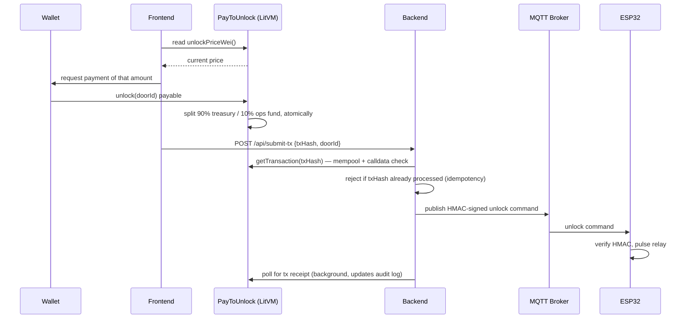

# BlockLock 2.0 - Pay-Per-Unlock on LitVM

A pay-per-unlock physical door lock on Litecoin's LitVM (Liteforge testnet). Send ~$1 worth of native zkLTC, an ESP32-controlled relay opens the door — no NFT, no separate token, no account. 10% of every payment automatically splits off to an operations fund, atomically, on-chain.

Built end-to-end: a Solidity payment contract, a Node.js verification/signaling backend, a React + wagmi frontend, and ESP32 firmware talking over MQTT — plus the infra to run it on a real server, guarding a real door. **Live at [dlb.tech](https://dlb.tech).**

This is a variant of [BlockLock](https://github.com/BREAKERNUMBER1/blocklock) built to test the same physical-access model on a different chain and a much simpler gate — see [Why this exists](#why-this-exists). It is a **separate project** from the original: different chain, different contract, different repo. Don't conflate the two.

## Contents

- [Demo](#demo)
- [Why LitVM](#why-litvm)
- [How it works](#how-it-works)
- [Why this exists](#why-this-exists)
- [Security design](#security-design)
- [Stack](#stack)
- [Repo layout](#repo-layout)
- [Status](#status)
- [Local setup](#local-setup)
- [Docs](#docs)

## Demo

<video src="https://dlb.tech/BlockLock_LitVM_Vid.mp4" controls width="640" preload="metadata"></video>

Tap the NFC tag → connect wallet → pay ~$1 in zkLTC → contract splits the payment on-chain (90% treasury / 10% ops fund) → MQTT unlock signal → physical lock opens.

*(Plays inline above. [Download the original .mov](https://github.com/BREAKERNUMBER1/blocklock-2.0/releases/download/demo-v1/BlockLock_LitVM_Vid.mov) if you'd rather have the file.)*

## Why LitVM

LitVM's Liteforge testnet is a ZK rollup that brings EVM compatibility to Litecoin (via BitcoinOS + Arbitrum Orbit) — it's new enough that there aren't many public builds on it yet. This project is a real physical device, not just a testnet transaction: a wallet payment on an unlisted L2 opens a real door in the real world, end to end.

- Chain: LitVM Liteforge Testnet — chain ID `4441`, native token zkLTC
- RPC: `https://liteforge.rpc.caldera.xyz/infra-partner-http`
- Explorer: `https://liteforge.explorer.caldera.xyz`
- Mainnet targeted H2 2026 — verify current parameters at `testnet.litvm.com` before relying on them, since this chain is still new and evolving.

## How it works



## Why this exists

This is a variant of [BlockLock](https://github.com/BREAKERNUMBER1/blocklock) (the original Ethereum/NFT-gated version) built to test the same physical-access model on a different chain and a much simpler gate: instead of proving NFT ownership, the payment itself is the credential — same trust model as a vending machine — and the payment-splitting logic lives entirely on-chain instead of in a backend that would otherwise have to custody funds.

## Security design

- **Payment is the only gate** — no wallet-signature login step exists, because there's nothing to prove beyond "a real payment of the right amount was confirmed on-chain." Removing an unnecessary auth layer here is a simplification, not a shortcut.
- **Atomic on-chain split** — the `PayToUnlock` contract pays treasury and operations fund in the same transaction as the unlock event; if either transfer fails, the whole call reverts (`ReentrancyGuard` + checks-effects-interactions), so funds can never be partially lost to a bad address.
- **Mempool + calldata validation** — the backend doesn't trust a client-supplied amount or door; it decodes the real `unlock(doorId)` calldata from the transaction, checks the door matches, and checks `tx.value` against the live on-chain price read from the contract (`blockchain.js`).
- **Payment idempotency** — `unlock_attempts.tx_hash` has a unique index, and `/api/submit-tx` rejects a txHash it's already processed, so a single confirmed payment can't be resubmitted for a second free unlock.
- **HMAC-signed MQTT commands** — the unlock signal to the ESP32 is authenticated with HMAC-SHA256 over the full payload (`mqttService.js` → `blocklock_main.ino`).
- **Replay protection** — the ESP32 NTP-syncs its clock at boot, rejects any signed command older than `MAX_COMMAND_AGE_SECONDS`, and keeps a ring of recently-accepted nonces so a captured, validly-signed unlock message can't be replayed a second time. Since payment is the only gate on this variant, this closes off the one path that would otherwise let a captured message unlock the door with no payment at all.
- **TLS-only MQTT broker + rate limiting** — Mosquitto runs on port 8883 with TLS, and `unlockLimiter` throttles the submit-tx endpoint.
- **Full audit trail** — every attempt (unlocked, tx pending, tx failed, denied) is logged with wallet, door, and failure reason, plus optional Discord alerts.

### Known limitations

- **TLS certificate verification is off by default** (`wifiClient.setInsecure()`). `docs/litvm-deployment.md` documents CA-cert pinning for production; it isn't the default.
- **Rate limits are dev-tuned** (50 requests/min/IP on `/api/submit-tx`, commented as "relaxed for testing").
- **Shares a WalletConnect/Reown project ID with the original BlockLock app** (Reown Starter-plan limit) — the wallet-connect popup currently shows "BlockLock" branding rather than "BlockLock-LitVM." Cosmetic only, but worth fixing before pointing an external/public audience at this.

## Stack

| Layer | Tech |
|---|---|
| Contracts | Solidity, Hardhat, OpenZeppelin (`PayToUnlock` — no mocks needed) |
| Backend | Node.js, Express, ethers.js, MQTT.js, better-sqlite3 |
| Frontend | React, Vite, wagmi, WalletConnect |
| Firmware | ESP32 (Arduino), PubSubClient over MQTT/TLS |
| Infra | Mosquitto (MQTT broker), Nginx |
| Chain | LitVM Liteforge Testnet (ZK rollup for Litecoin, BitcoinOS + Arbitrum Orbit) |

## Repo layout

```
contracts/   PayToUnlock.sol + Hardhat deploy/price-update/wallet-gen scripts
backend/     Express API — payment/tx validation, MQTT publishing, audit log
frontend/    React dApp — wallet connect, unlock flow UI
firmware/    ESP32 sketches — door controller + NFC tag writer
infra/       Mosquitto/Nginx config and server setup script
docs/        Architecture deep-dive + full deployment walkthrough for LitVM Liteforge testnet
```

## Status

Live end-to-end on LitVM Liteforge testnet at [dlb.tech](https://dlb.tech), including a verified real payment → contract → MQTT → physical unlock. LitVM mainnet is targeted for H2 2026 — see [`docs/litvm-deployment.md`](docs/litvm-deployment.md) for the full setup walkthrough, from wallet generation through server provisioning.

### Deployed contract (LitVM Liteforge Testnet, chain ID 4441)

| Contract | Address | Published |
|---|---|---|
| `PayToUnlock` | [`0xac5bBc05A04323fa336c1FC38c5Ee9356C6E4D6D`](https://liteforge.explorer.caldera.xyz/address/0xac5bBc05A04323fa336c1FC38c5Ee9356C6E4D6D) | 2026-09-02 |

Live and independently verifiable: `eth_getCode` for that address against LitVM's RPC (`https://liteforge.rpc.caldera.xyz/infra-partner-http`) returns the deployed `PayToUnlock` bytecode. LitVM's block-explorer indexer is new and doesn't yet flag every address as a contract, so the RPC node — not the explorer UI — is the ground truth here.

## Local setup

Each subproject has its own `.env.example` — copy to `.env` and fill in your own values (RPC URL, contract address, secrets). Firmware config is in `firmware/blocklock_main/config.h.example` — copy to `config.h` before flashing. See [`docs/litvm-deployment.md`](docs/litvm-deployment.md) for the full walkthrough.

## Docs

- [`docs/architecture.md`](docs/architecture.md) — component breakdown, request flow, trust boundaries, and design rationale
- [`docs/litvm-deployment.md`](docs/litvm-deployment.md) — wallet generation → LitVM deployment → server provisioning walkthrough
- [`docs/wiring.md`](docs/wiring.md) — relay/lock/ESP32 wiring diagram
